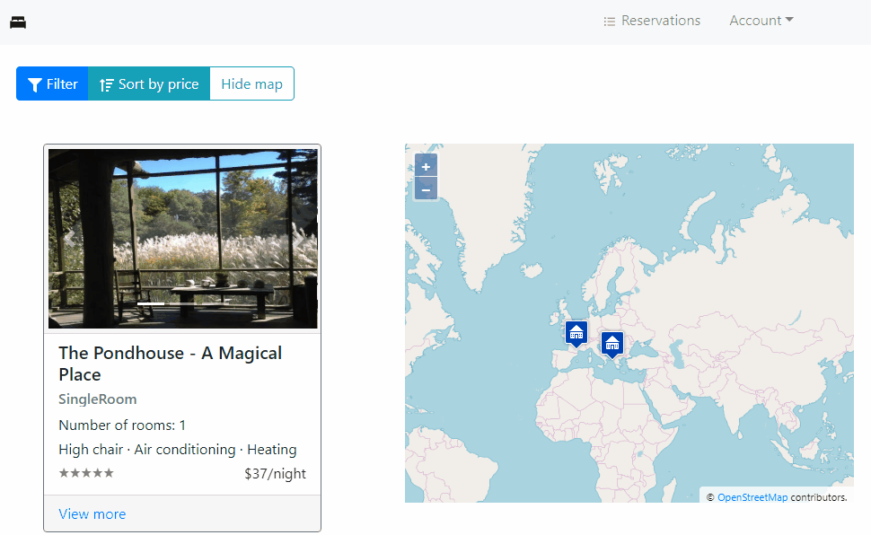

# ApartmentReservation

Apartment Reservation is a school project, built using ASP.NET Core, Entity Framework Core, MongoDB.Driver and React.

## Getting Started

Use these instructions to get the project up and running.

> Note: Application may not work properly on some versions of `Microsoft Edge` browser due to it's [bug with `fetch`](https://developer.microsoft.com/en-us/microsoft-edge/platform/issues/18775440/)

### Prerequisites

You will need the following tools:

* [Visual Studio 2017-2019](https://www.visualstudio.com/downloads/)
* [.NET Core SDK 2.1](https://www.microsoft.com/net/download/dotnet-core/2.1)
* [NPM](https://nodejs.org/en/)
* (Optional) [MongoDB](https://docs.mongodb.com/manual/tutorial/install-mongodb-on-windows/) - this is only if you wish to run it locally (*default connection string*)

### Setup

Follow these steps to get your development environment set up:

  1. Clone the repository
  1. Go to `ApartmentReservation.WebUI/ClientApp` directory and run: `npm install`
  1. Build solution in Visual Studio (2017 or 2019)
  1. (Optional) Modify connection strings in `ApartmentReservation.WebUI/appsettings.json`
  1. Start Application with `ApartmentReservation.WebUI` set as your StartUp Project

## Technologies

* .NET Core 2.1
* ASP.NET Core 2.1
* Entity Framework Core 2.1
* MongoDB.Driver 2.11
* React 16.8

## API Doc

Swagger API Doc can be found on `/swagger` or `/redoc` route.

More detailed documentation (currently only in Serbian language) can be found can be found [here](doc/documentation-rs.pdf)
